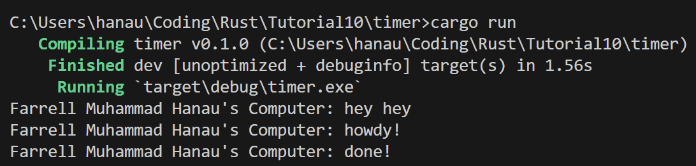
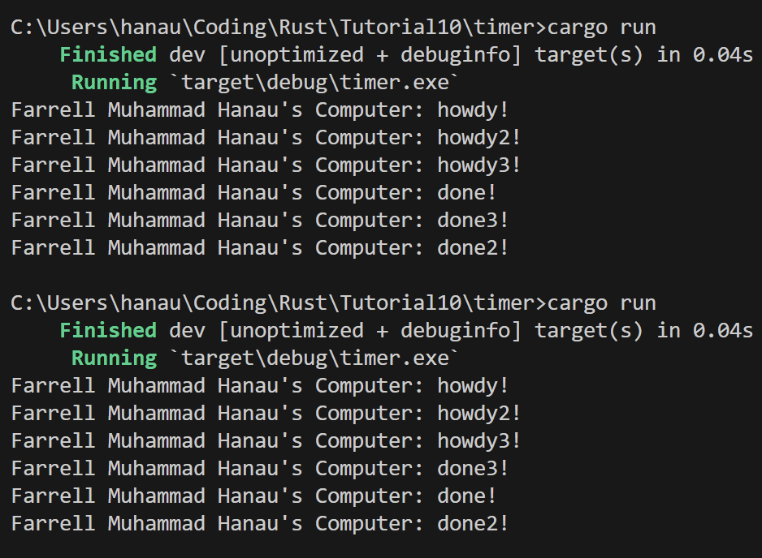
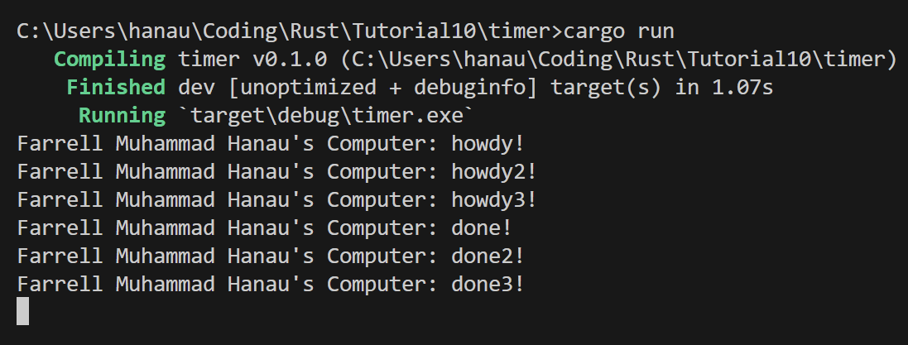

## 1.2. Understanding how it works.

Dari gambar tersebut, kalimat dengan akhiran "hey hey" akan dieksekusi terlebih dahulu sebelum dengan akhiran "howdy!" dan "done!". Hal ini dikarenakan "hey hey" di print sebelum executor.run() dimana executor.run() merupakan saat dimana task-task yang telah dispawn dijalankan, sehingga program akan mencetak "hey hey" terlebih dahulu lalu mengeksekusi task-task yang telah dispawn tersebut.

## 1.3. Multiple Spawn and removing drop
### Multiple Spawn dengan Drop

Dari foto diatas didapatkan bahwa kita tidak dapat mengetahui secara pasti urutan task / progress task yang akan dieksekusi oleh executor dimana run pertama dan kedua memiliki urutan print yang berbeda. Saat spawner mendaftarkan task untuk dieksekusi oleh executor, maka executor yang akan mengatur urutan kapan task-task tersebut dieksekusi dan ketika suatu task pending, maka executor dapat mengeksekusi task lain yang sudah ready. Meskipun masing-masing task pending selama 2 detik, akan tetapi pengaturan urutan pengeksekusian task-task tersebut bersifat random tergantung dengan sistem. 

### Multiple Spawn tanpa Drop

Ketika perintah drop dihapus / dicommend, maka executor tidak tahu apakah spawner akan mendaftarkan task lagi atau tidak. Hal ini menyebabkan executor akan selalu menunggu untuk menerima task-task yang akan di jadwalkan oleh spawner yang mengakibatkan program tidak akan berhenti.